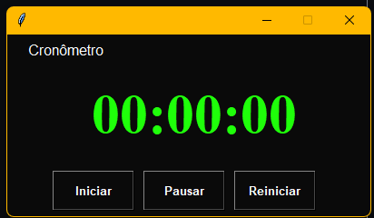

# Cronometro
Nesse projeto desenvolvi um cronometro simples em python utilizando Tkinter.
Pode ver abaixo:

Baseado no material de João Futi Muanda

Para a executar desse projeto ultilize o comando:

`python cronometro.py`

